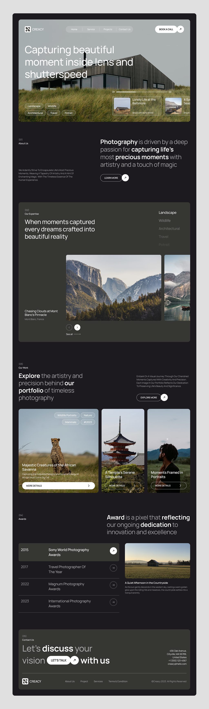

# Photography-Agency-Landing-Page
Photography Agency Landing Page

# Requirements
* Use Next.js, Tailwind CSS and Typescript.
* It should be responsive and look good on all screen sizes.
* Add animations, use gsap or framer motion whichever you think is light weight and easy to implement.

> NOTE: For `npx shadcn-ui@latest init`: Don't use CSS variables for colors.

# Design

# Responsibilities
1. Shivam: `our work` and `awards` section.
2. Raushan: `about us` and `expertise` section.
3. Krishna:  `navbar` and `main header` section.
4. Bittu: `contact us` and `footer section`
